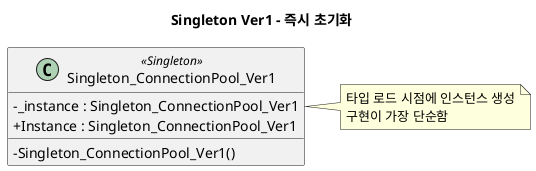
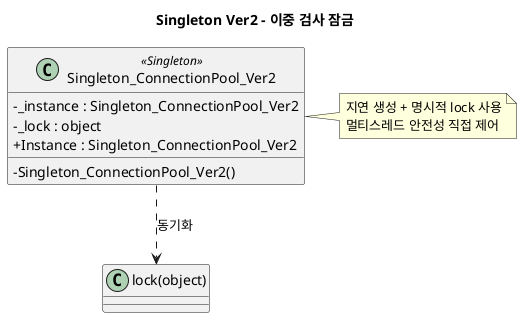
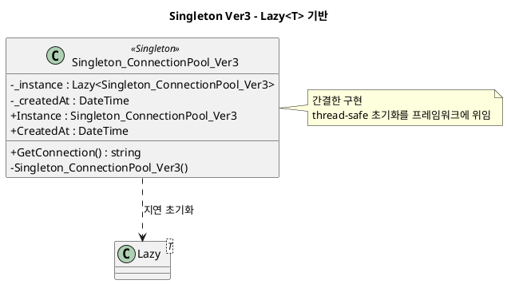

# Singleton 패턴 정리

## 1. 패턴 개요

Singleton 패턴은 애플리케이션 전체에서 특정 클래스의 인스턴스를 하나만 생성하고, 어디서든 동일 인스턴스에 접근하도록 만드는 생성 패턴이다.

핵심 목표는 다음 두 가지다.
- 인스턴스 유일성 보장
- 전역 접근 지점 제공

## 2. 예제 도메인 설명

본 예제는 `ConnectionPool` 스타일의 클래스를 가정한다. 
즉, 같은 연결 풀 객체를 여러 지점에서 공유해야 하므로 Singleton이 자연스럽게 적용된다.

버전 구성:
- `Singleton_ConnectionPool_Ver1`: 즉시 초기화(Eager Initialization)
- `Singleton_ConnectionPool_Ver2`: 이중 검사 잠금(Double-Checked Locking)
- `Singleton_ConnectionPool_Ver3`: `Lazy<T>` 기반 최종 개선형

## 3. 구현별 분석

### 3.1 Ver1 - 즉시 초기화

#### Pseudo Code

```text
class Ver1
    static instance = new Ver1()

    static property Instance
        return instance

    private constructor()
```

#### PlantUML




### 3.2 Ver2 - 이중 검사 잠금

#### Pseudo Code

```text
class Ver2
    static instance = null
    static lockObj

    static property Instance
        if instance == null
            lock(lockObj)
                if instance == null
                    instance = new Ver2()
        return instance

    private constructor()
```

#### PlantUML




### 3.3 Ver3 - `Lazy<T>` 기반

#### Pseudo Code

```text
class Ver3
    static lazyInstance = Lazy(() => new Ver3())
    field createdAt

    static property Instance
        return lazyInstance.Value

    property CreatedAt
        return createdAt

    method GetConnection()
        return "Connection created at ..."

    private constructor()
        createdAt = now
```

#### PlantUML




## 4. 각 버전별 차이점

| 항목 | Ver1 | Ver2 | Ver3 |
|---|---|---|---|
| 생성 시점 | 타입 로드 시 즉시 | 첫 접근 시 지연 생성 | 첫 접근 시 지연 생성 |
| 스레드 안전 처리 | 정적 초기화에 의존 | `lock` 직접 구현 | `Lazy<T>`에 위임 |
| 코드 복잡도 | 낮음 | 높음 | 낮음 |
| 제어 유연성 | 낮음 | 높음 | 중간 |
| 실무 권장도 | 제한적 | 상황 의존 | 높음 |
