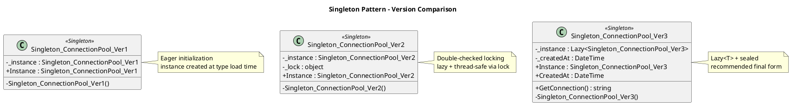
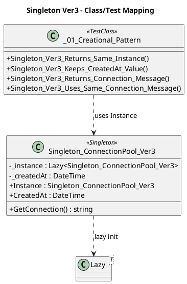

# Singleton 패턴 정리

## 01. 개요

Singleton 패턴은 특정 클래스의 인스턴스를 애플리케이션 전체에서 하나만 유지하고, 그 인스턴스에 전역적으로 접근할 수 있도록 만드는 생성 패턴이다.

현재 프로젝트의 예제는 버전이 올라갈수록 개선되는 흐름으로 구성되어 있다.

- `Singleton_ConnectionPool_Ver1`: 가장 단순한 eager 초기화
- `Singleton_ConnectionPool_Ver2`: `lock` 기반 Double-Checked Locking
- `Singleton_ConnectionPool_Ver3`: `Lazy<T> + sealed` 기반 최종 권장형

---

## 02. 구현별 분석

### 02.01. Ver1 - Eager Initialization

대상 파일:
- `src/01. Creational Pattern/Singleton_ConnectionPool_Ver1.cs`

핵심 코드:

```csharp
private static Singleton_ConnectionPool_Ver1 _instance = new Singleton_ConnectionPool_Ver1();

public static Singleton_ConnectionPool_Ver1 Instance => _instance;
```

설명:
- static 필드 초기화 시점에 인스턴스를 즉시 생성한다.
- 가장 단순한 Singleton 구현이다.
- 별도의 동기화 코드를 작성하지 않아도 된다.

장점:
- 코드가 단순하다.
- 개념 설명이 쉽다.
- 인스턴스 접근 시 추가 분기 비용이 없다.

단점:
- 실제 사용 여부와 상관없이 미리 생성된다.
- 생성 비용이 큰 객체에는 비효율적일 수 있다.

---

### 02.02. Ver2 - Double-Checked Locking

대상 파일:
- `src/01. Creational Pattern/Singleton_ConnectionPool_Ver2.cs`

핵심 코드:

```csharp
private static Singleton_ConnectionPool_Ver2 _instance;
private static readonly object _lock = new object();

public static Singleton_ConnectionPool_Ver2 Instance
{
    get
    {
        if (_instance == null)
        {
            lock (_lock)
            {
                if (_instance == null)
                {
                    _instance = new Singleton_ConnectionPool_Ver2();
                }
            }
        }

        return _instance;
    }
}
```

설명:
- lazy initialization을 직접 구현한 버전이다.
- 멀티스레드 환경에서 중복 생성을 막기 위해 `lock`을 사용한다.
- `sealed`가 적용되어 상속 가능성도 차단한다.

장점:
- lazy 방식과 thread-safe 처리 원리를 학습하기 좋다.
- 제어 흐름이 명시적이다.

단점:
- 구현이 복잡하다.
- 동기화 로직을 직접 관리해야 한다.

---

### 02.03. Ver3 - Lazy`<T>` + sealed

대상 파일:
- `src/01. Creational Pattern/Singleton_ConnectionPool_Ver3.cs`

핵심 코드:

```csharp
private static readonly Lazy<Singleton_ConnectionPool_Ver3> _instance =
    new Lazy<Singleton_ConnectionPool_Ver3>(() => new Singleton_ConnectionPool_Ver3());

public static Singleton_ConnectionPool_Ver3 Instance => _instance.Value;
```

설명:
- `Instance`에 처음 접근할 때 객체가 생성된다.
- `Lazy<T>`가 지연 생성과 thread-safe 초기화를 함께 처리한다.
- `sealed`를 사용해 상속을 막아 Singleton 의도를 더 분명하게 표현한다.
- 현재 프로젝트에서는 가장 개선된 최종 버전으로 볼 수 있다.

장점:
- 간결하다.
- 유지보수성이 좋다.
- thread-safe를 직접 구현하지 않아도 된다.
- 실무형 예제로 설명하기 좋다.

단점:
- 내부 동작 원리를 학습할 때는 Ver2보다 추상화 수준이 높다.

---

## 03. Ver3에 추가된 개선 요소

이번 `Ver3`에는 단순히 인스턴스만 제공하는 수준을 넘어서, Singleton의 목적을 더 쉽게 이해할 수 있는 요소를 추가했다.

### 03.01. 생성 시각 보관

```csharp
private readonly DateTime _createdAt;
public DateTime CreatedAt => _createdAt;
```

의미:
- 객체가 언제 생성되었는지 확인할 수 있다.
- 같은 인스턴스가 계속 재사용되는지 테스트와 예제에서 더 쉽게 검증할 수 있다.

### 03.02. 실제 동작 메서드 추가

```csharp
public string GetConnection()
{
    return $"Connection created at {_createdAt:O}";
}
```

의미:
- Singleton이 단순히 "객체 하나만 존재"하는 개념이 아니라,
  공유 자원에 접근하는 단일 진입점이라는 점을 보여준다.
- `ConnectionPool` 예제 이름과도 더 자연스럽게 연결된다.

---

## 04. 버전별 비교

| 구분 | Ver1 | Ver2 | Ver3 |
|---|---|---|---|
| 생성 시점 | 클래스 로드 시 즉시 생성 | 첫 접근 시 생성 | 첫 접근 시 생성 |
| 구현 방식 | static 필드 직접 초기화 | `lock` + double check | `Lazy<T> + sealed` |
| thread-safe 처리 | static 초기화에 기대는 방식 | 직접 `lock`으로 처리 | `Lazy<T>`가 처리 |
| 코드 복잡도 | 낮음 | 높음 | 낮음 |
| 학습 포인트 | Singleton 기본 개념 | 멀티스레드 제어 원리 | 실무형 최종 구현 |
| 유지보수성 | 좋음 | 상대적으로 낮음 | 좋음 |

---

## 05. Singleton 사용 시 주의점

Singleton은 편리하지만 무조건 좋은 패턴은 아니다.

### 05.01. 전역 상태 증가

어디서든 접근할 수 있다는 점은 편리하지만, 전역 상태가 증가하면 코드 흐름이 숨겨지고 구조가 복잡해질 수 있다.

### 05.02. 테스트 어려움

상태를 가지는 Singleton은 테스트 간 영향이 생기기 쉽다. 테스트 독립성이 약해질 수 있다.

### 05.03. 결합도 증가

여러 클래스가 Singleton에 직접 의존하면 구조가 단단히 묶일 수 있다. 이 경우 교체와 확장이 어려워진다.

### 05.04. DI와의 관계

실무에서는 직접 Singleton 클래스를 만들기보다 DI 컨테이너에서 singleton lifetime을 등록해 관리하는 방식이 더 적합할 때도 많다.

---

## 06. 현재 프로젝트 기준 해석

현재 프로젝트는 버전이 올라갈수록 다음 흐름으로 읽히도록 구성되어 있다.

1. `Ver1`
가장 단순한 Singleton 기본형

2. `Ver2`
멀티스레드 안전성을 직접 제어하는 확장형

3. `Ver3`
`Lazy<T> + sealed`를 사용하고, 실제 예제 메서드와 생성 시점 정보까지 포함한 최종 개선형

즉, 학습 흐름은 아래처럼 이해하면 자연스럽다.

- Ver1: 개념 이해
- Ver2: 동기화 원리 이해
- Ver3: 실무형 완성본 이해

---

## 07. 결론

현재 코드 기준으로 가장 추천하기 쉬운 구조는 `Ver3`이다.

이유는 다음과 같다.

- `Lazy<T>`를 통해 lazy initialization과 thread-safe를 간결하게 해결한다.
- `sealed`로 상속을 차단해 Singleton 의도를 분명하게 드러낸다.
- `CreatedAt`, `GetConnection()` 같은 요소를 통해 예제 목적과 사용 맥락도 더 잘 드러난다.

정리하면, 이 프로젝트의 Singleton 예제는 `Ver1 -> Ver2 -> Ver3`로 갈수록 더 실용적이고 완성도 높은 형태로 개선되는 흐름을 가진다.

---

## 08. Class Diagram (PlantUML)

설명 보완을 위해 클래스 구조와 테스트 매핑을 PlantUML로 분리했습니다.

### 08.01. Version Comparison




### 08.02. Ver3 + Test Mapping




## 09. Test Mapping

| Test Method | Verified Relationship |
|---|---|
| `Singleton_Ver1_Returns_Same_Instance` | `Ver1.Instance` always returns the same object |
| `Singleton_Ver2_Returns_Same_Instance` | `Ver2.Instance` is singleton under lock-based lazy init |
| `Singleton_Ver3_Returns_Same_Instance` | `Ver3.Instance` is singleton via `Lazy<T>` |
| `Singleton_Ver3_Keeps_CreatedAt_Value` | `CreatedAt` is identical across all `Instance` accesses |
| `Singleton_Ver3_Returns_Connection_Message` | `GetConnection()` exposes singleton state in a message |
| `Singleton_Ver3_Uses_Same_Connection_Message` | Message output stays consistent because the instance is shared |
