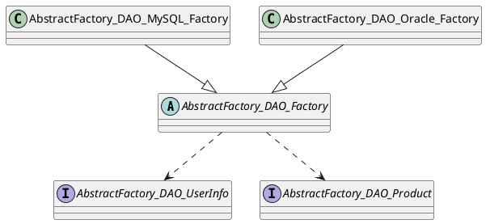
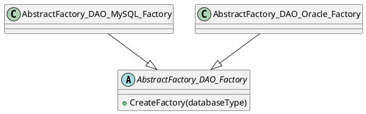
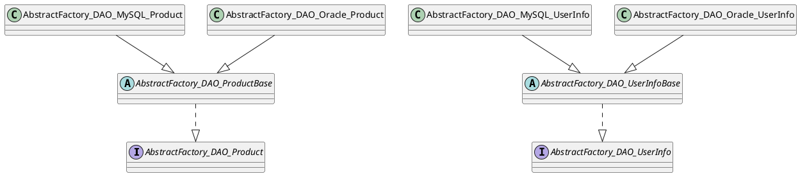

# AbstractFactory 패턴 정리

## 1. 패턴 개요

AbstractFactory 패턴은 서로 관련된 객체 집합을 구체 클래스 이름에 직접 의존하지 않고 생성할 수 있게 만드는 패턴이다.  
이 예제에서는 DBMS 종류에 따라 `UserInfo DAO`와 `Product DAO`를 한 제품군으로 취급한다.

## 2. 예제 도메인 설명

도메인은 사용자 정보와 상품 정보를 저장하는 DAO 계층이다.  
클라이언트는 MySQL 또는 Oracle 중 하나를 선택하고, 선택된 DBMS에 맞는 DAO 조합을 받아 저장 명령을 수행한다.

## 3. 버전별 분석

### 3.1 Ver1 - 직접 팩토리 선택

초기 학습 버전은 추상 팩토리와 구체 팩토리를 나누어 두었지만, 클라이언트가 어떤 팩토리를 생성할지 직접 알아야 한다.  
또한 DAO 구현마다 명령 문자열 생성 규칙이 흩어져 있어 오타와 포맷 차이가 생기기 쉽다.

#### Pseudo Code

```text
클라이언트가 OracleFactory 또는 MySQLFactory를 직접 선택합니다.
팩토리가 UserInfoDao와 ProductDao를 생성합니다.
각 DAO는 자체 명령어 텍스트를 생성합니다.
```

#### PlantUML



### 3.2 Ver2 - 팩토리 선택 책임 집약

`Version 02`에서는 `CreateFactory(string databaseType)`를 추가해 클라이언트가 구체 팩토리 이름을 직접 알지 않아도 되도록 개선했다.  
이 단계의 핵심은 생성 책임을 추상 팩토리 진입점으로 모으는 것이다. 동시에 Oracle 메시지 표기도 정리했다.

#### Pseudo Code

```text
factory = AbstractFactory_DAO_Factory.CreateFactory("oracle")
userDao = factory.CreateUserInfoDao()
productDao = factory.CreateProductDao()
```

#### PlantUML



### 3.3 Ver3 - 공통 DAO 동작 표준화

`Version 03`에서는 `ProductBase`, `UserInfoBase`를 도입해 중복된 명령 생성 로직을 공통화했다.  
이 단계는 생성 방식이 아니라 DAO 동작의 일관성을 다루는 구조 변경이므로 별도 버전으로 분리했다. null 입력도 여기서 방어한다.

#### Pseudo Code

```text
abstract dao base validates input
abstract dao base builds common command text
concrete dao only provides ProviderName
```

#### PlantUML



## 4. 버전 차이점

| 항목 | Ver1 | Ver2 | Ver3 |
|---|---|---|---|
| 팩토리 선택 | 클라이언트가 직접 생성 | 정적 진입점으로 선택 | Ver2 유지 |
| DAO 메시지 규칙 | 구현별 중복 | 구현별 중복 | 공통 베이스로 통일 |
| 입력 검증 | 없음 | 팩토리 선택만 검증 | DAO 입력까지 검증 |
| 학습 포인트 | 기본 구조 이해 | 생성 책임 축소 | 중복 제거와 안정성 강화 |

## 5. C# 문법 설명
### 5.1 추상 팩토리 계약 (`abstract` + `interface`)
- 대상 코드: `AbstractFactory_DAO_Factory`, `AbstractFactory_DAO_UserInfo`, `AbstractFactory_DAO_Product`
- 선언 의미: 객체군 생성 계약(팩토리)과 사용 계약(DAO)을 분리해 구현 교체를 가능하게 한다.
- 실행 시 동작: 클라이언트는 구체 타입 대신 추상 타입으로 DAO를 생성/호출한다.
- 주의점/오해하기 쉬운 차이: 추상화 계층이 늘면 구현 추적이 어려워지므로 네이밍/폴더 규칙을 같이 유지해야 한다.

### 5.2 팩토리 선택 분기와 예외 계약
- 대상 코드: `CreateFactory(string databaseType)`의 `switch`, `throw`, `nameof`
- 선언 의미: 입력 문자열을 표준화(`Trim`, 소문자화)해 분기하고, 잘못된 입력을 명시적으로 거부한다.
- 실행 시 동작: 지원 DB 타입만 팩토리가 생성되고, 그 외 입력은 즉시 예외로 실패한다.
- 주의점/오해하기 쉬운 차이: `null`/공백 입력과 미지원 타입 입력은 같은 실패처럼 보여도 원인이 다르므로 예외 메시지를 구분해야 한다.
