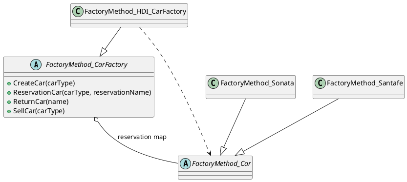
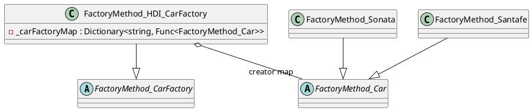

# FactoryMethod 패턴 정리

## 1. 패턴 개요
FactoryMethod 패턴은 객체 생성 책임을 하위 팩토리로 분리해, 생성 대상 확장 시 기존 호출 코드를 최소 수정으로 유지하게 한다.  
이 예제에서는 `FactoryMethod_CarFactory`가 공통 판매 흐름을 제공하고, `FactoryMethod_HDI_CarFactory`가 실제 차종 생성을 담당한다.

## 2. 예제 도메인 설명
도메인은 자동차 공장 예약/판매 시나리오다.

- 입력된 차종 문자열로 차량 인스턴스를 생성한다.
- 예약자 이름별로 차량을 보관하고 재조회한다.
- 판매 프로세스에서 번호 발급(`Numbering`)과 세차(`WashCar`)를 공통 처리한다.

## 3. 버전별 분석

### 3.1 Ver1 - 분기문 기반 생성의 기준 구현
`Version 01`은 학습용 기준 구현으로, `CreateCar`에서 `if/else` 분기로 차량 타입을 판별한다.  
하지만 `Santafe` 분기 오탈자(중복 조건)로 인해 일부 차종을 정상 생성하지 못하는 결함이 있다.

#### Pseudo Code
```text
if carType == Sonata
  return Sonata
else if carType == Sonata  // 버그: Santafe여야 함
  return Sonata
else
  throw
```

#### PlantUML


### 3.2 Ver2 - 등록 기반 생성으로 구조 개선
`Version 02`는 생성 분기문을 등록 맵(`Dictionary<string, Func<FactoryMethod_Car>>`)으로 변경했다.  
이 변경으로 차종 추가 시 분기문 수정 대신 맵 등록만으로 확장 가능하며, Ver1의 `Santafe` 생성 결함도 함께 해결된다.  
또한 `CreateCar`, `ReservationCar`, `ReturnCar`, `SellCar`에 문자열 입력 검증을 추가해 예외 동작을 명확히 했다.

#### Pseudo Code
```text
map = {
  "FactoryMethod_Sonata"  -> new Sonata()
  "FactoryMethod_Santafe" -> new Santafe()
}

if carType is null/blank
  throw

if map contains trimmed carType (case-insensitive)
  return mapped creator()
else
  throw
```

#### PlantUML


## 4. 버전 차이
| 항목 | Ver1 | Ver2 |
|---|---|---|
| 생성 방식 | `if/else` 분기문 | 등록 맵 기반 동적 선택 |
| 확장성 | 차종 추가 시 분기문 수정 필요 | 맵 등록으로 확장 |
| 알려진 결함 | `Santafe` 생성 실패 버그 존재 | 버그 수정 완료 |
| 입력 검증 | 없음 | 주요 API 공백 입력 검증 추가 |
| 테스트 관점 | 기준 동작/결함 재현 | 결함 해결 + 회귀 방지 |
