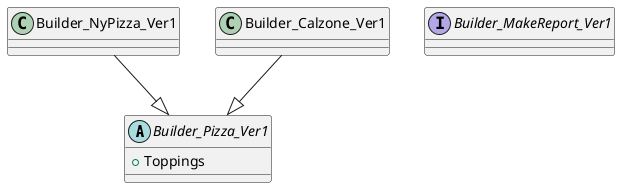
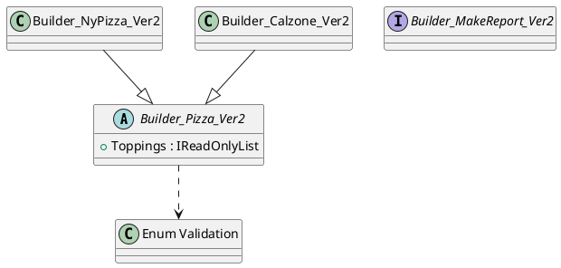
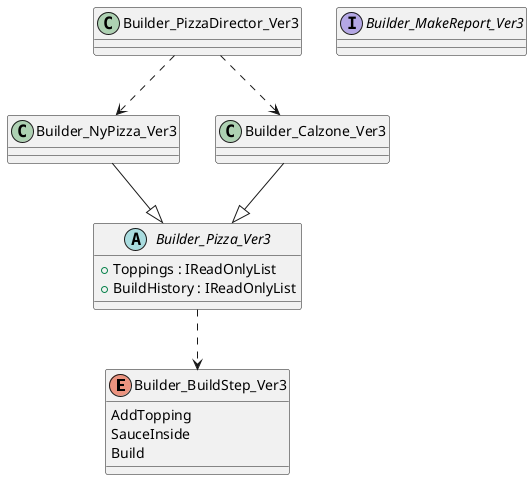

---
type: Note
creation date: 2026-04-15 09:40
tags:
  - creational_pattern
  - doc
  - builder
backlinks:
  - "[[doc/01. Creational Pattern/_MOC_.md|01. Creational Pattern]]"
outgoinglinks:
---

# Builder 패턴 정리

## 1. 패턴 개요
Builder 패턴은 복잡한 객체 생성 과정을 단계별로 분리하고, 동일한 생성 절차로 서로 다른 결과 객체를 만들 수 있도록 한다.

이번 반영에서는 Java 학습 코드를 C#으로 변환해 `Version 01`에 배치하고, 코드 리뷰 결과를 기반으로 `Version 02`, `Version 03`으로 단계적 개선을 적용했다.

## 2. 원본 GitHub 기준
- 저장소: `https://github.com/easyspubjava/DesignPatternLAB`
- 기준 경로: `Builder/src`
- 변환 기준 파일:
  - `Builder/src/effecivejava/Pizza.java`
  - `Builder/src/effecivejava/NyPizza.java`
  - `Builder/src/effecivejava/Calzone.java`
  - `Builder/src/effecivejava/PizzaTest.java`
  - `Builder/src/gof/MakeReport.java`

## 3. 버전별 구성 및 개선

### 3.1 Version 01 - Java 원본 구조 C# 이식
- 경로:
  - `src/01. Creational Pattern/Builder/Version 01/effecivejava/Builder_Pizza_Ver1.cs`
  - `src/01. Creational Pattern/Builder/Version 01/effecivejava/Builder_NyPizza_Ver1.cs`
  - `src/01. Creational Pattern/Builder/Version 01/effecivejava/Builder_Calzone_Ver1.cs`
  - `src/01. Creational Pattern/Builder/Version 01/GOF/Builder_MakeReport_Ver1.cs`
- 반영 내용:
  - `Pizza`, `NyPizza`, `Calzone` Builder 체인을 C#으로 변환
  - `PizzaTest.main` 흐름(토핑 추가 -> build) 유지
  - `MakeReport` 인터페이스를 C# 인터페이스로 변환

#### Pseudo Code
```text
builder = new NyPizza.Builder(SMALL)
builder.AddTopping(SAUSAGE)
builder.AddTopping(ONION)
pizza = builder.Build()
```

#### PlantUML


### 3.2 Version 02 - 입력/상태 검증 강화
- 경로:
  - `src/01. Creational Pattern/Builder/Version 02/effecivejava/Builder_Pizza_Ver2.cs`
  - `src/01. Creational Pattern/Builder/Version 02/effecivejava/Builder_NyPizza_Ver2.cs`
  - `src/01. Creational Pattern/Builder/Version 02/effecivejava/Builder_Calzone_Ver2.cs`
  - `src/01. Creational Pattern/Builder/Version 02/GOF/Builder_MakeReport_Ver2.cs`
- 개선 내용:
  - `Build` 시 토핑 최소 1개 필수 검증
  - 잘못된 enum 입력(`Size`, `Topping`) 예외 처리
  - 정렬 + 읽기 전용 토핑 스냅샷 제공

#### Pseudo Code
```text
if size not valid -> throw
if topping not valid -> throw
if toppings count == 0 on Build -> throw
return immutable pizza snapshot
```

#### PlantUML


### 3.3 Version 03 - 생성 절차 가시화(Director + BuildHistory)
- 경로:
  - `src/01. Creational Pattern/Builder/Version 03/effecivejava/Builder_Pizza_Ver3.cs`
  - `src/01. Creational Pattern/Builder/Version 03/effecivejava/Builder_NyPizza_Ver3.cs`
  - `src/01. Creational Pattern/Builder/Version 03/effecivejava/Builder_Calzone_Ver3.cs`
  - `src/01. Creational Pattern/Builder/Version 03/effecivejava/Builder_BuildStep_Ver3.cs`
  - `src/01. Creational Pattern/Builder/Version 03/GOF/Builder_PizzaDirector_Ver3.cs`
  - `src/01. Creational Pattern/Builder/Version 03/GOF/Builder_MakeReport_Ver3.cs`
- 개선 내용:
  - Director로 메인 시나리오 생성 절차 캡슐화
  - `BuildHistory`로 단계 순서 기록
  - Builder 재사용 시 이전 결과 스냅샷 보존

#### Pseudo Code
```text
director.CreateMainScenarioNyPizza()
  -> AddTopping
  -> AddTopping
  -> Build
store BuildHistory with product snapshot
```

#### PlantUML


## 4. Version 차이
- Version 01: Java 구조 충실 이식
- Version 02: 검증/예외/일관성 강화
- Version 03: Director 도입 및 빌드 이력 추적

## 5. Unit Test 구성
- 테스트 파일: `src/unitTest/01. Creational Pattern/01. Creational Pattern - Builder.cs`
- 검증 범위:
  - Version 01: 원본 시나리오 재현(NyPizza/Calzone)
  - Version 02: 입력/상태 검증
  - Version 03: Director 흐름 및 상태 전이 순서 검증

## 6. Scenario 기준(원본 매핑)
- 원본 시나리오: `Builder/src/effecivejava/PizzaTest.java`
  - `NyPizza.Builder(Size.SMALL).addTopping(SAUSAGE).addTopping(ONION).build()`
  - `Calzone.Builder().addTopping(HAM).addTopping(PEPPER).sauceInside().build()`
- C# 반영:
  - Version 01: 동일 입력 시퀀스 직접 재현
  - Version 03: Director로 동일 시퀀스 캡슐화 + `BuildHistory` 순서 검증

## 7. C# 문법 설명
### 7.1 `new` 키워드 역할 (`Builder_NyPizza_Ver1`)
- 대상 코드: `public new class Builder : Builder_Pizza_Ver1.Builder`
- 선언 의미:
  - 여기서 `new`는 객체 생성이 아니라, 상위 클래스(`Builder_Pizza_Ver1`)에 이미 있는 중첩 타입 이름 `Builder`를 하위 클래스(`Builder_NyPizza_Ver1`)에서 같은 이름으로 다시 정의할 때 사용하는 "이름 숨김(hiding)" 선언이다.
- 실행 시 동작:
  - `Builder_NyPizza_Ver1.Builder`를 통해 NY Pizza 전용 Builder를 직접 사용할 수 있다.
  - 기반 타입 계약은 `Builder_Pizza_Ver1.Builder`로 유지되어, 상위 Builder 흐름과 다형성을 함께 활용할 수 있다.
- 주의점/오해하기 쉬운 차이:
  - `new Builder_NyPizza_Ver1.Builder(Size.SMALL)`처럼 표현식에서의 `new`는 객체 인스턴스를 생성하는 키워드다.
  - 즉, 선언부의 `new class`는 "멤버 숨김", 표현식의 `new ...()`는 "인스턴스 생성"이라는 서로 다른 역할이다.

### 7.2 스냅샷 노출 (`IReadOnly*`)과 체인 다형성 (`virtual/override`)
- 대상 코드: `Builder_Pizza_Ver2/Ver3`의 `IReadOnlyList`, `IReadOnlyCollection`, `virtual SauceInside`, `override Build`
- 선언 의미: 내부 컬렉션을 읽기 전용 스냅샷으로 노출하고, 체인 메서드 확장은 하위 Builder가 override로 제어한다.
- 실행 시 동작: 생성된 Pizza는 외부에서 토핑/히스토리를 직접 변경할 수 없고, 하위 Builder는 자기 타입 규칙(NyPizza/Calzone)을 유지한 채 체인을 이어간다.
- 주의점/오해하기 쉬운 차이: `IReadOnly*`는 "인터페이스 읽기 전용"이지 내부 리스트 자체 불변을 자동 보장하지 않으므로 생성 시점 복제(snapshop)가 함께 필요하다.
