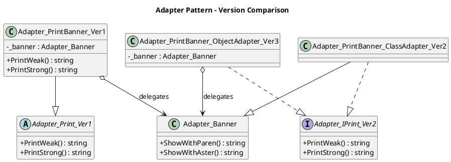
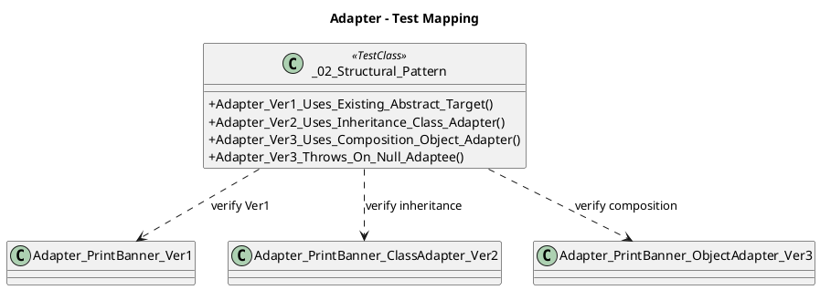

# Adapter 패턴 정리

## 01. 개요

Adapter 패턴은 기존 클래스(Adaptee)의 인터페이스를 클라이언트가 기대하는 Target 인터페이스로 변환해 재사용성을 높이는 구조 패턴이다.

현재 예제는 학습 순서가 보이도록 단계별로 구성되어 있다.

- `Ver1`: 기존 `abstract class` Target 사용
- `Ver2`: 상속 방법(Class Adapter)
- `Ver3`: 합성 방법(Object Adapter)

## 02. 예제 구성

- Adaptee: `Adapter_Banner`
- Target(Ver1): `Adapter_Print_Ver1` (abstract class)
- Adapter(Ver1): `Adapter_PrintBanner_Ver1`
- Target(Ver2/Ver3): `Adapter_IPrint_Ver2` (interface)
- Adapter(Ver2): `Adapter_PrintBanner_ClassAdapter_Ver2` (상속)
- Adapter(Ver3): `Adapter_PrintBanner_ObjectAdapter_Ver3` (합성)

## 03. 단계별 개선

### 03.01. Ver1 - 기존 추상 Target 유지

`Adapter_PrintBanner_Ver1`이 `Adapter_Print_Ver1`을 상속하고 내부에서 `Adapter_Banner`를 위임 호출한다.

```csharp
public override string PrintWeak()
{
    return _banner.ShowWithParen();
}

public override string PrintStrong()
{
    return _banner.ShowWithAster();
}
```

### 03.02. Ver2 - 상속 방법 (Class Adapter)

`Adapter_PrintBanner_ClassAdapter_Ver2`가 `Adapter_Banner`를 직접 상속하고 `Adapter_IPrint_Ver2`를 구현한다.

```csharp
public class Adapter_PrintBanner_ClassAdapter_Ver2 : Adapter_Banner, Adapter_IPrint_Ver2
{
    public Adapter_PrintBanner_ClassAdapter_Ver2(string value) : base(value) { }

    public string PrintWeak() => ShowWithParen();
    public string PrintStrong() => ShowWithAster();
}
```

특징:
- 장점: 위임 객체가 없어 코드가 단순하다.
- 제약: C# 단일 상속 제약으로 다른 기반 클래스와 조합이 어렵다.

### 03.03. Ver3 - 합성 방법 (Object Adapter)

`Adapter_PrintBanner_ObjectAdapter_Ver3`가 `Adapter_Banner` 인스턴스를 필드로 보유하고 위임한다.

```csharp
private readonly Adapter_Banner _banner;

public Adapter_PrintBanner_ObjectAdapter_Ver3(Adapter_Banner banner)
{
    _banner = banner ?? throw new ArgumentNullException(nameof(banner));
}

public string PrintWeak() => _banner.ShowWithParen();
public string PrintStrong() => _banner.ShowWithAster();
```

특징:
- 장점: 상속 제약이 없고 교체/테스트가 쉽다.
- 개선: `null` adaptee 방어 코드 포함.

## 04. 상속 vs 합성 비교

| 구분 | Ver2 상속(Class Adapter) | Ver3 합성(Object Adapter) |
|---|---|---|
| 구현 방식 | Adaptee를 직접 상속 | Adaptee 인스턴스를 보유 |
| 결합도 | 기반 클래스에 강결합 | 인터페이스/구성으로 느슨함 |
| 확장성 | 단일 상속 제약 존재 | 런타임 교체/확장 유리 |
| 테스트 용이성 | 상대적으로 제한적 | 목 객체/대체 객체 주입 용이 |
| 권장 상황 | 단순하고 상속 가능한 환경 | 실무 일반 케이스(권장) |

## 05. Class Diagram (PlantUML)

### 05.01. Version Comparison



### 05.02. Test Mapping



## 06. Unit Test Code

파일: `src/unitTest/02. Structural Pattern/02. Structural Pattern - Adapter.cs`

```csharp
using _02.Structural_Pattern.Adapter;
using Microsoft.VisualStudio.TestTools.UnitTesting;

namespace unitTest._02._Structural_Pattern
{
    public partial class _02_Structural_Pattern
    {
        [TestMethod("[Adapter Ver1 Uses Existing Abstract Target]")]
        public void Adapter_Ver1_Uses_Existing_Abstract_Target()
        {
            Adapter_Banner banner = new Adapter_Banner("Hello Adapter");
            Adapter_PrintBanner_Ver1 bannerAdapter = new Adapter_PrintBanner_Ver1(banner);

            Assert.AreEqual(banner.ShowWithParen(), bannerAdapter.PrintWeak());
            Assert.AreEqual(banner.ShowWithAster(), bannerAdapter.PrintStrong());
        }

        [TestMethod("[Adapter Ver2 Uses Inheritance Class Adapter]")]
        public void Adapter_Ver2_Uses_Inheritance_Class_Adapter()
        {
            Adapter_IPrint_Ver2 printer = new Adapter_PrintBanner_ClassAdapter_Ver2("Hello Adapter");

            Assert.AreEqual("(Hello Adapter)", printer.PrintWeak());
            Assert.AreEqual("*Hello Adapter*", printer.PrintStrong());
        }

        [TestMethod("[Adapter Ver3 Uses Composition Object Adapter]")]
        public void Adapter_Ver3_Uses_Composition_Object_Adapter()
        {
            Adapter_Banner banner = new Adapter_Banner("Hello Adapter");
            Adapter_IPrint_Ver2 printer = new Adapter_PrintBanner_ObjectAdapter_Ver3(banner);

            Assert.AreEqual("(Hello Adapter)", printer.PrintWeak());
            Assert.AreEqual("*Hello Adapter*", printer.PrintStrong());
        }

        [TestMethod("[Adapter Ver3 Throws On Null Adaptee]")]
        public void Adapter_Ver3_Throws_On_Null_Adaptee()
        {
            Assert.ThrowsException<System.ArgumentNullException>(
                () => new Adapter_PrintBanner_ObjectAdapter_Ver3(null));
        }
    }
}
```

## 07. Test Mapping Table

| Test Method | Verified Relationship |
|---|---|
| `Adapter_Ver1_Uses_Existing_Abstract_Target` | Ver1 adapter delegates to adaptee through existing abstract target |
| `Adapter_Ver2_Uses_Inheritance_Class_Adapter` | Ver2 class adapter behavior via inheritance |
| `Adapter_Ver3_Uses_Composition_Object_Adapter` | Ver3 object adapter behavior via composition delegation |
| `Adapter_Ver3_Throws_On_Null_Adaptee` | Ver3 guard clause for invalid adaptee input |
