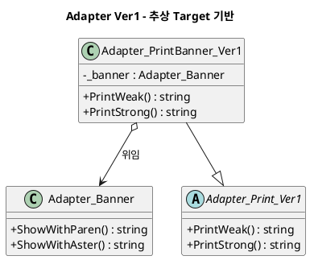
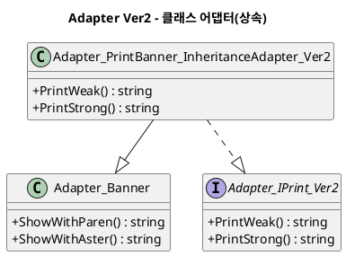
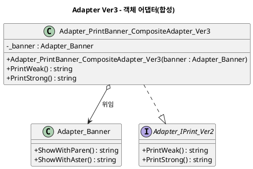

# Adapter 패턴 정리

## 1. 패턴 개요

Adapter 패턴은 기존 클래스(Adaptee)의 인터페이스를 클라이언트가 기대하는 인터페이스(Target)로 변환해 재사용을 가능하게 만드는 구조 패턴이다.

핵심 목적:
- 기존 코드 재사용
- 인터페이스 불일치 해소
- 클라이언트 코드 변경 최소화

## 2. 예제 도메인 설명

예제는 문자열 출력 포맷을 바꾸는 간단한 출력 도메인이다.

- Adaptee: `Adapter_Banner`
  - `ShowWithParen()`
  - `ShowWithAster()`

버전 구성:
- `Ver1`: 기존 `abstract class` Target 사용 (`Adapter_Print_Ver1`)
- `Ver2`: 상속 기반 클래스 어댑터 (`Adapter_PrintBanner_InheritanceAdapter_Ver2`)
- `Ver3`: 합성 기반 객체 어댑터 (`Adapter_PrintBanner_CompositeAdapter_Ver3`)

## 3. 구현별 분석

### 3.1 Ver1 - 기존 추상 Target 사용

#### Pseudo Code

```text
abstract class PrintVer1
    abstract PrintWeak()
    abstract PrintStrong()

class PrintBannerVer1 extends PrintVer1
    field banner

    constructor(banner)
        this.banner = banner

    PrintWeak()   -> banner.ShowWithParen()
    PrintStrong() -> banner.ShowWithAster()
```

#### PlantUML



### 3.2 Ver2 - 상속 기반 클래스 어댑터

#### Pseudo Code

```text
interface IPrintVer2
    PrintWeak()
    PrintStrong()

class InheritanceAdapterVer2 extends Banner implements IPrintVer2
    constructor(value)
        base(value)

    PrintWeak()   -> ShowWithParen()
    PrintStrong() -> ShowWithAster()
```

#### PlantUML



### 3.3 Ver3 - 합성 기반 객체 어댑터

#### Pseudo Code

```text
interface IPrintVer2
    PrintWeak()
    PrintStrong()

class CompositeAdapterVer3 implements IPrintVer2
    field banner

    constructor(banner)
        if banner is null -> 예외
        this.banner = banner

    PrintWeak()   -> banner.ShowWithParen()
    PrintStrong() -> banner.ShowWithAster()
```

#### PlantUML



## 4. 각 버전별 차이점

| 항목 | Ver1 | Ver2 | Ver3 |
|---|---|---|---|
| Target 형태 | 추상 클래스 | 인터페이스 | 인터페이스 |
| 적용 방식 | 위임(기존 구조 유지) | 상속 | 합성 |
| 결합도 | 중간 | 높음(기반 클래스 의존) | 낮음(구성 기반) |
| 확장성 | 중간 | 낮음~중간 | 높음 |
| 실무 권장도 | 중간 | 제한적 | 높음 |
