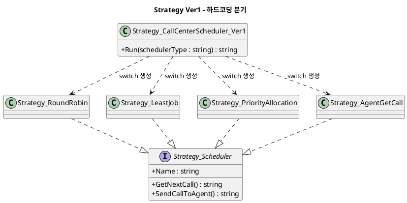
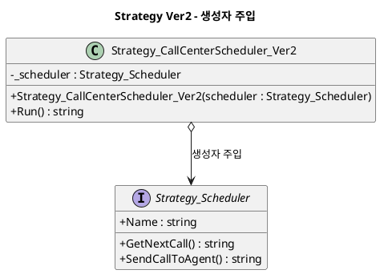
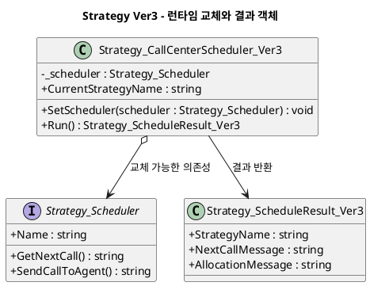

# Strategy 패턴 정리

## 1. 패턴 개요

Strategy 패턴은 동일한 목적의 알고리즘을 각각 독립 클래스로 분리하고, 실행 시점에 필요한 알고리즘을 교체해 사용하는 행위 패턴이다.

핵심 목적:
- 조건문 기반 분기 제거
- 알고리즘 교체 가능성 확보
- 변경 영향 범위 축소

## 2. 예제 도메인 설명

예제 도메인은 콜센터 스케줄링이다.

- 공통 전략 인터페이스: `Strategy_Scheduler`
  - `Name`
  - `GetNextCall()`
  - `SendCallToAgent()`
- 구체 전략:
  - `Strategy_RoundRobin`
  - `Strategy_LeastJob`
  - `Strategy_PriorityAllocation`
  - `Strategy_AgentGetCall`

버전 구성:
- `Ver1`: 문자열 기반 하드코딩 분기
- `Ver2`: 생성자 주입 기반 전략 사용
- `Ver3`: 런타임 전략 교체 + 구조화 결과 반환

## 3. 구현별 분석

### 3.1 Ver1 - 하드코딩 분기

#### Pseudo Code

```text
Run(schedulerType: string) -> string
    switch(schedulerType)
        "RoundRobin"         -> scheduler = new RoundRobin()
        "LeastJob"           -> scheduler = new LeastJob()
        "PriorityAllocation" -> scheduler = new PriorityAllocation()
        "AgentGetCall"       -> scheduler = new AgentGetCall()
        default               -> 예외

    return "이름 | 다음콜 | 배정결과" 문자열
```

#### PlantUML



### 3.2 Ver2 - 생성자 주입 기반

#### Pseudo Code

```text
class SchedulerVer2
    field scheduler

    constructor(scheduler)
        if scheduler == null -> 예외
        this.scheduler = scheduler

    Run() -> string
        return "이름 | 다음콜 | 배정결과" 문자열
```

#### PlantUML



### 3.3 Ver3 - 런타임 교체 + 결과 객체

#### Pseudo Code

```text
class SchedulerVer3
    field scheduler

    constructor(scheduler)
        SetScheduler(scheduler)

    SetScheduler(scheduler)
        if scheduler == null -> 예외
        this.scheduler = scheduler

    CurrentStrategyName -> scheduler.Name

    Run() -> ScheduleResult
        return new ScheduleResult(
            scheduler.Name,
            scheduler.GetNextCall(),
            scheduler.SendCallToAgent())
```

#### PlantUML



## 4. 각 버전별 차이점

| 항목 | Ver1 | Ver2 | Ver3 |
|---|---|---|---|
| 전략 선택 위치 | 컨텍스트 내부 `switch` | 외부에서 생성자 주입 | 외부 주입 + 런타임 교체 |
| 컨텍스트 수정 필요성 | 높음 | 낮음 | 매우 낮음 |
| 전략 교체 시점 | 실행 전 문자열 분기 | 객체 생성 시 | 실행 중 교체 가능 |
| 반환 형태 | `string` | `string` | `Strategy_ScheduleResult_Ver3` |
| 실무 확장성 | 낮음 | 중간 | 높음 |

## 5. �ҽ� ���� (Version Folder)

- `src/03. Behavioral Pattern/Strategy/Version 01/01. Strategy/`
- `src/03. Behavioral Pattern/Strategy/Version 01/02. Concrete/`
- `src/03. Behavioral Pattern/Strategy/Version 01/03. Context/`
- `src/03. Behavioral Pattern/Strategy/Version 02/01. Strategy/`
- `src/03. Behavioral Pattern/Strategy/Version 02/02. Concrete/`
- `src/03. Behavioral Pattern/Strategy/Version 02/03. Context/`
- `src/03. Behavioral Pattern/Strategy/Version 03/01. Strategy/`
- `src/03. Behavioral Pattern/Strategy/Version 03/02. Concrete/`
- `src/03. Behavioral Pattern/Strategy/Version 03/03. Context/`
- `src/03. Behavioral Pattern/Strategy/Version 03/04. Result/`

�� ������ Strategy �������̽��� Concrete �������� �������� ���� �����ϸ�, `Version 03`�� Result ��ü�� �߰��� ������ ���� �ܰ踦 �и��Ѵ�.
