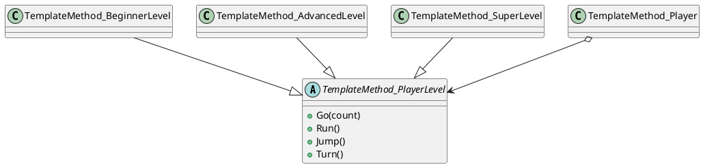
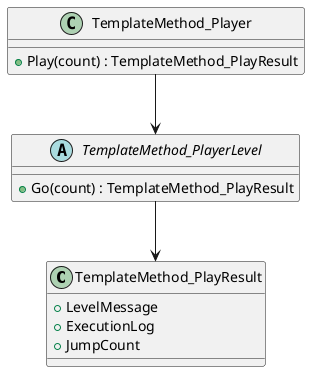
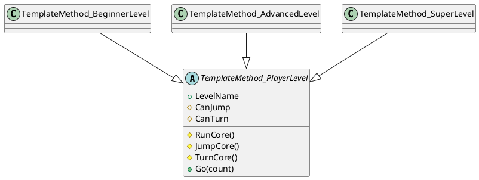

# TemplateMethod 패턴 정리

## 1. 패턴 개요

TemplateMethod 패턴은 상위 클래스에서 알고리즘의 전체 순서를 고정하고, 세부 단계는 하위 클래스가 구현하도록 분리하는 행위 패턴이다.

## 2. 예제 도메인 설명

게임 캐릭터(`Player`)의 플레이 순서를 템플릿으로 고정한다.
- 순서: `Run -> Jump 반복 -> Turn`
- 레벨별(`Beginner/Advanced/Super`)로 실제 동작을 다르게 구현한다.

## 3. 버전별 분석

### 3.1 Ver1 - 기본 템플릿과 콘솔 출력 중심

#### Pseudo Code

```text
abstract PlayerLevel
  Go(count):
    Run()
    repeat count: Jump()
    Turn()

Player
  default level = Beginner
  UpgradeLevel(level)
  Play(count) -> level.Go(count)
```

#### PlantUML



### 3.2 Ver2 - 실행 결과 객체 도입

`PlayResult`를 추가해 템플릿 실행 결과를 구조화했다. 또한 `count < 0`, `UpgradeLevel(null)`에 대한 방어 로직을 추가했다.

#### Pseudo Code

```text
Go(count):
  validate count >= 0
  levelMessage = ShowLevelMessage()
  executionLog = Run + Jump*N + Turn
  return PlayResult(levelMessage, executionLog, count)

Player.Play(count) -> PlayResult
```

#### PlantUML



### 3.3 Ver3 - Hook Method 구조로 단계 제어

`CanJump`, `CanTurn`, `JumpCore`, `TurnCore` 훅을 도입해 레벨별 중복 코드를 줄였다. 하위 클래스는 가능한 동작만 override하면 된다.

#### Pseudo Code

```text
abstract PlayerLevel
  RunCore() abstract
  CanJump/CanTurn virtual false
  JumpCore/TurnCore virtual unsupported message

  Go(count):
    RunCore()
    repeat count:
      if CanJump then JumpCore else unsupported jump
    if CanTurn then TurnCore else unsupported turn
```

#### PlantUML



## 4. 버전 차이

| 항목 | Ver1 | Ver2 | Ver3 |
|---|---|---|---|
| 결과 형태 | `void/string` 중심 | `PlayResult` 도입 | `PlayResult` 유지 |
| 입력 검증 | 없음 | `count`, `level` 검증 | Ver2 유지 |
| 하위 클래스 책임 | 모든 단계 구현 | 모든 단계 구현 | 훅 기반으로 필요한 단계만 구현 |
| 중복 코드 | 높음 | 중간 | 낮음 |

## 5. 소스 구조 (Version Folder)

- `src/03. Behavioral Pattern/TemplateMethod/Version 01/`
- `src/03. Behavioral Pattern/TemplateMethod/Version 02/`
- `src/03. Behavioral Pattern/TemplateMethod/Version 03/`

각 버전은 독립 네임스페이스(`Version_01`, `Version_02`, `Version_03`)를 사용하며, 버전 간 소스 참조가 없다.
