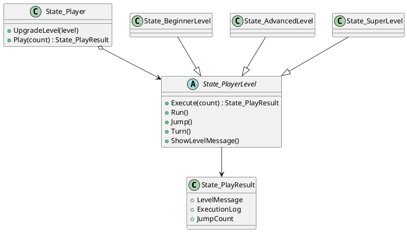

# State 패턴 정리

## 1. 패턴 개요

State 패턴은 객체의 내부 상태가 바뀔 때 동일한 요청(`Play`)에 대한 동작을 상태 객체(`PlayerLevel`)로 분리해 변경 가능하게 만드는 행위 패턴이다.

## 2. 예제 도메인 설명

게임 캐릭터(`State_Player`)의 레벨에 따라 `Run`, `Jump`, `Turn` 동작이 달라진다.
- 초보자: 달리기만 가능
- 중급자: 달리기 + 점프 가능
- 상급자: 달리기 + 점프 + 턴 가능

## 3. 코드 리뷰 (Version 01)

### 3.1 확인 내용
- `UpgradeLevel(null)`에 대한 방어 코드가 없다.
- `Play(count)`에서 음수 입력 검증이 없다.
- 실행 결과가 단일 문자열이라 레벨 메시지/실행 로그/입력값을 분리해 검증하기 어렵다.
- 생성자 및 각 상태 메서드에서 콘솔 출력 부작용이 발생한다.

### 3.2 개선 방향
- Version 02에서 실행 결과 모델을 도입해 테스트 가능성과 가독성을 높인다.
- 입력값과 상태 전환 파라미터에 대한 예외 처리를 추가한다.

## 4. 버전별 분석

### 4.1 Ver1 - 상태 분기의 기본 구조

`State_Player`가 현재 레벨 객체를 보유하고, `Play`에서 레벨별 동작 메서드를 호출한다.

### 4.2 Ver2 - 실행 결과 모델 도입

`State_PlayResult`를 추가해 실행 결과를 구조화했다.
- `LevelMessage`
- `ExecutionLog`
- `JumpCount`

또한 다음 방어 로직을 추가했다.
- `Play(count < 0)` -> `ArgumentOutOfRangeException`
- `UpgradeLevel(null)` -> `ArgumentNullException`

#### Pseudo Code

```text
PlayerLevel.Execute(count):
  if count < 0 -> throw
  levelMessage = ShowLevelMessage()
  log = Run + Jump*N + Turn
  return PlayResult(levelMessage, log, count)

Player.UpgradeLevel(level):
  if level is null -> throw
  this.level = level

Player.Play(count):
  return level.Execute(count)
```

#### PlantUML



## 5. 버전 차이

| 항목 | Ver1 | Ver2 |
|---|---|---|
| 반환 형태 | 문자열 로그 | `State_PlayResult` |
| 입력 검증 | 없음 | `count`, `level` 검증 |
| 테스트 용이성 | 낮음 | 높음 |
| 부작용 | 콘솔 출력 의존 | 반환값 중심 |

## 6. 테스트 포인트

- Ver1 기본 동작: 기본 레벨, 점프 불가 메시지 확인
- Ver2 개선 동작: 구조화 결과 반환, null/음수 입력 예외 확인
